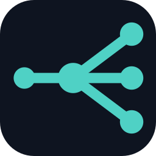

<div align="center">



# brainmux Companion

**The local runtime for brainmux — your data and compute stay on your machine.**

[](LICENSE)
[](https://github.com/brainmuxhq/brainmux-companion/releases/latest)
[](#install)
[](#from-source)

</div>

---

brainmux runs an AI agent fleet on **your own machine**. The Companion is the small native
launcher (~2 MB, written in Rust) that makes that one double-click: it provisions what's
missing, starts the local engine on `127.0.0.1`, and opens the console. Nothing about your
work data leaves the device.

This is a **BYOC (bring-your-own-compute) hybrid**: the *control plane* (sign-in, billing, the
web console) is hosted in the cloud; the *data plane* (the engine, the AI model, your files)
runs locally, next to your data.

```
        Cloud — Control Plane                    Your machine — Data Plane
   ┌────────────────────────────┐          ┌──────────────────────────────────┐
   │  app.brainmux.com          │  HTTPS   │  brainmux Companion (this repo)   │
   │  auth · billing · console  │◀────────▶│   ├─ engine     127.0.0.1:8787    │
   └────────────────────────────┘          │   ├─ Ollama + model (local)       │
                                            │   └─ your files  (never leave)    │
                                            └──────────────────────────────────┘
```

## Why local-first

- **Your data never leaves the machine.** Documents, embeddings, and generated output live in
  `~/.brainmux`, served only on `127.0.0.1`.
- **Open source.** The Companion is Apache-2.0 — audit every line before you run it.
- **No telemetry.** The engine is started with telemetry disabled; nothing phones home.
- **Reproducible downloads.** Every release ships a `SHA256` you can verify.

## Install

### One-click (recommended)

1. **Download** the latest AppImage:
   [`brainmux-x86_64.AppImage`](https://github.com/brainmuxhq/brainmux-companion/releases/latest/download/brainmux-x86_64.AppImage)
2. **Double-click** it. No system install, no terminal. On first run it auto-provisions the AI
   engine and model (progress is shown as a desktop notification), then opens the console.

The AppImage is **FUSE-independent** — it runs even on distributions that don't ship `libfuse2`
(it self-extracts when FUSE is absent). Running it a second time just brings the console to the
front instead of starting a duplicate.

Verify the download (optional):

```sh
sha256sum -c brainmux-x86_64.AppImage.sha256
```

### From source

```sh
cargo build --release
./target/release/brainmux
```

## How it works

The launcher does four things, then waits:

1. **Filesystem provisioning** — creates `~/.brainmux/{logs,models,knowledge,output,runtime}`.
2. **Zero-State auto-provision** — ensures the Ollama daemon is up and the embedding model
   (`bge-m3`) is present, pulling it on first run with a live progress readout.
3. **Runs the local engine** on `127.0.0.1:8787` (RAG, document generation — all local).
4. **Opens the console** and stays running.

**Clean shutdown, no orphans.** Children start in their own process group; quitting from the
web console (`Lokal Modu Durdur` → `POST /shutdown`) or `Ctrl+C` tears the whole tree down.

## Architecture

The Companion is a **thin shell**: all runtime logic is *imported* from `brainmux-core`, never
copied — so there is a single source of truth and no drift. The Companion only orchestrates:
provision → run engine → open console → (later) tray, pairing, updates.

The full design record (Control/Data Plane split, ADR-0011) lives in the product repository.

## Build the AppImage

```sh
packaging/linux/build-appimage.sh      # → dist/brainmux-x86_64.AppImage
```

The script compiles the release binary, assembles the AppDir (icon + `.desktop` + `AppRun`),
fetches `appimagetool` and a static FUSE-independent runtime, and packages a single file.

## Status & roadmap

**v0.1 is a developer / dogfood preview.** Today the launcher orchestrates a local brainmux
core checkout (it expects `uv`, Node, and Ollama available on the machine). The next milestone
makes it fully self-contained for any user:

- [x] Rust bootstrapper: provisioning · Zero-State model pull · run engine · open console
- [x] Single-instance guard · desktop notifications · clean process-group teardown
- [x] Web-initiated shutdown (`POST /shutdown`)
- [x] One-click Linux AppImage (FUSE-independent)
- [ ] Self-contained bundle: portable Python + engine + Ollama from CDN (zero host prerequisites)
- [ ] Pairing token for the hosted console · background auto-updater
- [ ] macOS & Windows builds · system-tray control

## License

[Apache-2.0](LICENSE). The vendored engine's attribution is preserved in [`NOTICE`](NOTICE).
